##git应用详解

###常见libux命令介绍

- cd [path]
- mkdir [packagename]  //创建文件夹
- touch [filename]  //创建文件
- cat [filename]  //查看文件内容
- vim [filename]  //编辑文件
- echo 'whatyouwanttowirtetofile' > [feilname] //将你想写的内容重定向到该文件中，会把原内容覆盖

###git在各种平台下的安装与配置

1. 安装 

- linux(ubantu)

sudo apt-get install git

- mac

  安装命令行工具

  homebrew

  macports


- windos

  通过msysGIt

  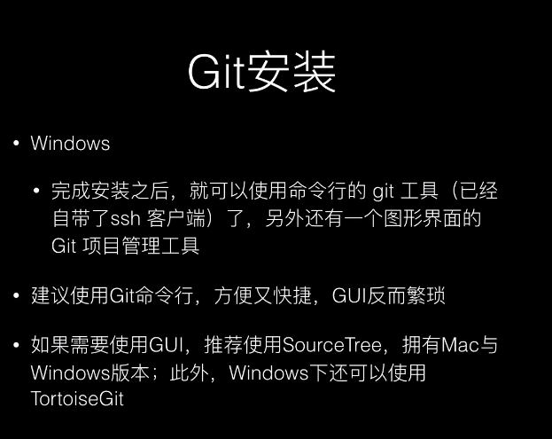

2. 查看git版本

  git --version 


bash zsh oh my zsh 加强版的bash


###Git的基本原理

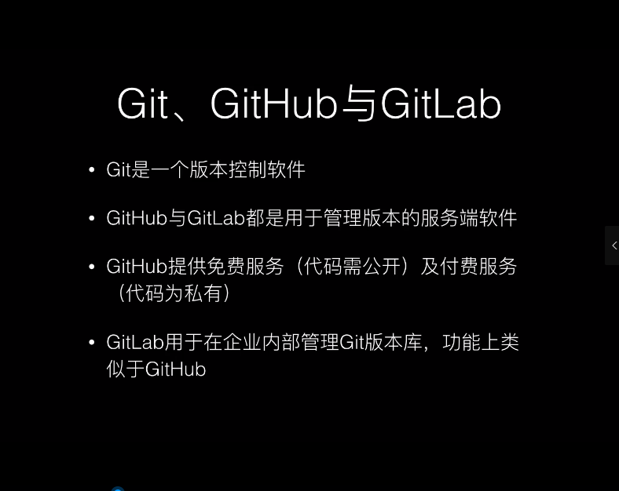

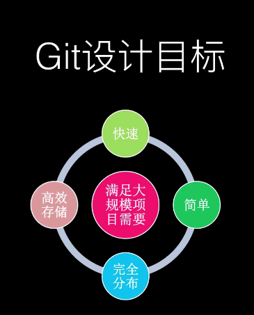

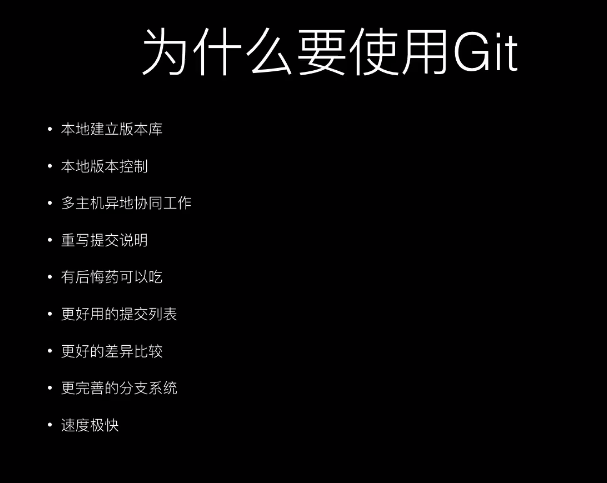

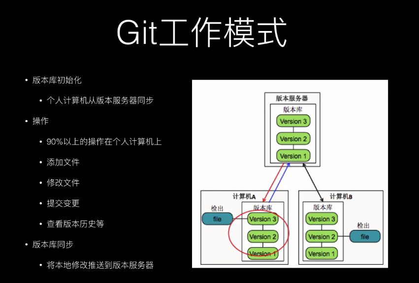

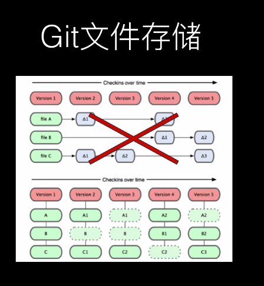 

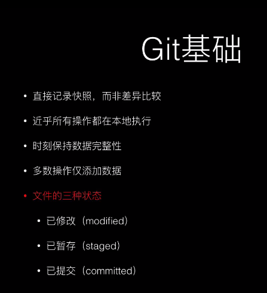

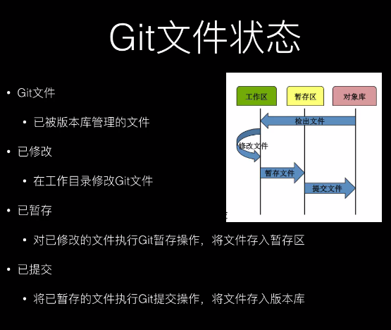

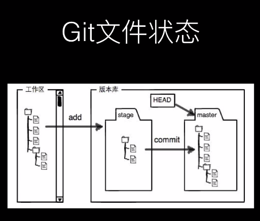

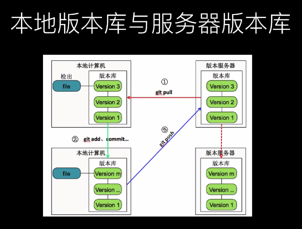

### Git常用命令

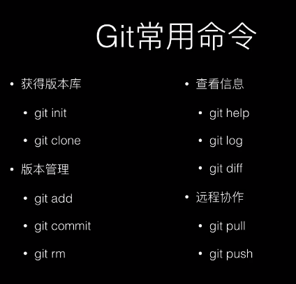

- git init //在当前文件夹下初始化git创建本地git仓库
- git status //查看当前仓库状态，会显示当前添加的文件和修改的内容
- git add <filename> //将当前文件添加到暂存区  . 代表所有文件
- git rm --cached <file> //使用该命令可以将add添加到暂存区的修移除
- git reset HEAD <file>  //将add到暂存区的修改移除  根据提示使用
- git commit //将当前暂存区的修改提交
- git commit -m 'message' //直接将message 作为注释将修改添加到仓库
- git config --[where] user.name "" //添加姓名  -- system --global --local
- git config --[where] user.email "" //添加email 
- git config --[where] --unset user.name //删除配置
- git checkout -- <filename> 将该文件为纳入git仓库中的修改移除
- git mv filename1 filename2 重命名
- ​

git rm 的作用
1、删除了文件
2、将删除文件纳入到暂存区

```
想恢复被删除的文件需要进行两个操作
a.git git rm test2.txt 将被删除的文件从暂存区恢复到工作区
b.git checkout -- test2.txt 将工作区中的修改丢弃掉
```

rm 
  1、将文件删掉这时被删除的文件并未纳入暂存区中

```
  如果要纳入暂存区
  git add test2.txt
a.git checkout -- test2.txt 将工作区中的修改丢弃掉
```

git文件状态

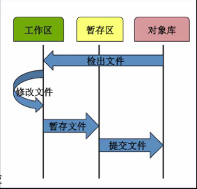

### 

###缓存区与工作区与git提交

###版本回退

###修改与撤销修改文件的添加与删除

### git对象类型与索引

### git分支

### 如何创建切换与删除分支

### git在项目开发中的作用

### git分支在工程化项目中的最佳实践

### 分支常见命令详解

### git merge

### git冲突解决策略

### HEAD详解

### Git commit修改详解

### 远程版本库介绍

### 如何使用远程版本库

### 何时使用submodule

### Git Subtree详解

### git subtree的使用方式详解

### .gitignore的正确使用方式

##Gitlab

### .git私服gitlab的搭建方法

### 在工资内部使用GItlab作为版本控制服务器

### gitLab使用详解

### 如何使用gitlab管理项目分组用户角色

###Gitlab issue与提交使用技巧

## github

###github使用方式介绍

## 实践

搭建基于 intellij IDEA的Java开发环境

搭建已于Gradle的Java开发环境

GIt与INtellij IDEA的整合方式详解

Gradle初步使用

.gitIgnore最佳实践


